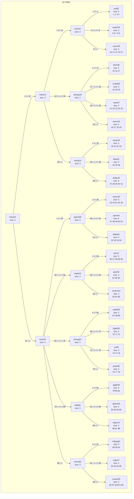

```mermaid
graph TD
subgraph B+TREE
vfexa51[vfexa51<br/>size: 2<br/>]
nvltm14[nvltm14<br/>size: 3<br/>]
ohxbv5[ohxbv5<br/>size: 3<br/>]
yuqfj2[yuqfj2<br/>size: 4<br/>1 2 3 4 ]
ohxbv5-->|x <= 4|yuqfj2
uepnh32[uepnh32<br/>size: 5<br/>5 6 7 8 9 ]
ohxbv5-->|4 < x <= 9|uepnh32
xyurx48[xyurx48<br/>size: 5<br/>10 11 12 13 14 ]
ohxbv5-->|9 < x|xyurx48
nvltm14-->|x <= 14|ohxbv5
ekmqy49[ekmqy49<br/>size: 4<br/>]
eluin38[eluin38<br/>size: 3<br/>15 16 17 ]
ekmqy49-->|x <= 17|eluin38
cmefq55[cmefq55<br/>size: 3<br/>18 19 20 ]
ekmqy49-->|17 < x <= 20|cmefq55
viyel10[viyel10<br/>size: 5<br/>21 22 23 24 25 ]
ekmqy49-->|20 < x <= 25|viyel10
nxevo23[nxevo23<br/>size: 4<br/>26 27 28 29 ]
ekmqy49-->|25 < x|nxevo23
nvltm14-->|14 < x <= 29|ekmqy49
wevip24[wevip24<br/>size: 3<br/>]
secto18[secto18<br/>size: 4<br/>30 31 32 33 ]
wevip24-->|x <= 33|secto18
tidae41[tidae41<br/>size: 3<br/>34 35 36 ]
wevip24-->|33 < x <= 36|tidae41
pidhp25[pidhp25<br/>size: 5<br/>37 38 39 40 41 ]
wevip24-->|36 < x|pidhp25
nvltm14-->|29 < x|wevip24
vfexa51-->|x <= 41|nvltm14
tsrbz50[tsrbz50<br/>size: 5<br/>]
sgmra42[sgmra42<br/>size: 3<br/>]
xrkzm20[xrkzm20<br/>size: 5<br/>42 43 44 45 46 ]
sgmra42-->|x <= 46|xrkzm20
rgmha4[rgmha4<br/>size: 5<br/>47 48 49 50 51 ]
sgmra42-->|46 < x <= 51|rgmha4
dkpla31[dkpla31<br/>size: 4<br/>52 53 54 55 ]
sgmra42-->|51 < x|dkpla31
tsrbz50-->|x <= 55|sgmra42
ohpql13[ohpql13<br/>size: 3<br/>]
yknzj7[yknzj7<br/>size: 5<br/>56 57 58 59 60 ]
ohpql13-->|x <= 60|yknzj7
qesir52[qesir52<br/>size: 3<br/>61 62 63 ]
ohpql13-->|60 < x <= 63|qesir52
wcqms12[wcqms12<br/>size: 3<br/>64 65 66 ]
ohpql13-->|63 < x|wcqms12
tsrbz50-->|55 < x <= 66|ohpql13
dmoyg57[dmoyg57<br/>size: 4<br/>]
yeqht56[yeqht56<br/>size: 3<br/>67 68 69 ]
dmoyg57-->|x <= 69|yeqht56
sfgdd36[sfgdd36<br/>size: 3<br/>70 71 72 ]
dmoyg57-->|69 < x <= 72|sfgdd36
vyrfi9[vyrfi9<br/>size: 3<br/>73 74 75 ]
dmoyg57-->|72 < x <= 75|vyrfi9
jksdz58[jksdz58<br/>size: 3<br/>76 77 78 ]
dmoyg57-->|75 < x|jksdz58
tsrbz50-->|66 < x <= 78|dmoyg57
febij30[febij30<br/>size: 3<br/>]
aglkb29[aglkb29<br/>size: 3<br/>79 80 81 ]
febij30-->|x <= 81|aglkb29
qbiam40[qbiam40<br/>size: 4<br/>82 83 84 85 ]
febij30-->|81 < x <= 85|qbiam40
irgwe16[irgwe16<br/>size: 3<br/>86 87 88 ]
febij30-->|85 < x|irgwe16
tsrbz50-->|78 < x <= 88|febij30
nswru62[nswru62<br/>size: 3<br/>]
mbbyg61[mbbyg61<br/>size: 3<br/>89 90 91 ]
nswru62-->|x <= 91|mbbyg61
xxjfw27[xxjfw27<br/>size: 4<br/>92 93 94 95 ]
nswru62-->|91 < x <= 95|xxjfw27
wuqva45[wuqva45<br/>size: 5<br/>96 97 98 99 100 ]
nswru62-->|95 < x|wuqva45
tsrbz50-->|88 < x|nswru62
vfexa51-->|41 < x|tsrbz50
end
```

```mermaid
graph LR
subgraph UNORDERED_HEAP
lrfkq1[lrfkq1<br/>size: 4<br/>46 89 60 62 ]
afvga3[afvga3<br/>size: 4<br/>20 4 55 47 ]
lrfkq1-->afvga3
hobgb6[hobgb6<br/>size: 4<br/>27 54 93 85 ]
afvga3-->hobgb6
hxbcx8[hxbcx8<br/>size: 4<br/>37 72 69 2 ]
hobgb6-->hxbcx8
yajvl11[yajvl11<br/>size: 4<br/>78 67 63 80 ]
hxbcx8-->yajvl11
rurxe15[rurxe15<br/>size: 4<br/>29 43 70 95 ]
yajvl11-->rurxe15
fihxd17[fihxd17<br/>size: 4<br/>18 25 42 86 ]
rurxe15-->fihxd17
fhpgf19[fhpgf19<br/>size: 4<br/>77 83 39 41 ]
fihxd17-->fhpgf19
ipmcy21[ipmcy21<br/>size: 4<br/>21 51 28 99 ]
fhpgf19-->ipmcy21
swata22[swata22<br/>size: 4<br/>24 36 35 32 ]
ipmcy21-->swata22
smaza26[smaza26<br/>size: 4<br/>3 91 53 61 ]
swata22-->smaza26
mmygz28[mmygz28<br/>size: 4<br/>73 49 14 75 ]
smaza26-->mmygz28
hdsnu33[hdsnu33<br/>size: 4<br/>52 33 82 8 ]
mmygz28-->hdsnu33
blsfq34[blsfq34<br/>size: 4<br/>59 38 94 15 ]
hdsnu33-->blsfq34
qrnnw35[qrnnw35<br/>size: 4<br/>79 71 65 34 ]
blsfq34-->qrnnw35
eessx37[eessx37<br/>size: 4<br/>96 13 68 90 ]
qrnnw35-->eessx37
lkhko39[lkhko39<br/>size: 4<br/>64 81 1 31 ]
eessx37-->lkhko39
lfqbh43[lfqbh43<br/>size: 4<br/>30 22 10 44 ]
lkhko39-->lfqbh43
gtyec44[gtyec44<br/>size: 4<br/>45 26 23 98 ]
lfqbh43-->gtyec44
afprf46[afprf46<br/>size: 4<br/>17 9 16 40 ]
gtyec44-->afprf46
ztpau47[ztpau47<br/>size: 4<br/>74 87 6 56 ]
afprf46-->ztpau47
xsbdp53[xsbdp53<br/>size: 4<br/>5 97 11 12 ]
ztpau47-->xsbdp53
iajdq54[iajdq54<br/>size: 4<br/>92 19 66 76 ]
xsbdp53-->iajdq54
livde59[livde59<br/>size: 4<br/>100 48 50 84 ]
iajdq54-->livde59
cpgzy60[cpgzy60<br/>size: 4<br/>58 88 57 7 ]
livde59-->cpgzy60
end
```
